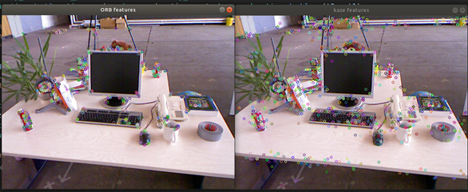
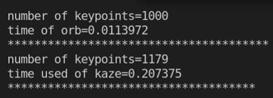

```C++
#include <iostream>
#include <opencv2/core/core.hpp>
#include <opencv2/features2d/features2d.hpp>
#include <opencv2/highgui/highgui.hpp>
#include <chrono>

using namespace std;
using namespace cv;

int main(int argc, char** argv) {
    if (argc < 2) {
        cout << argc << endl;
        cout << "usage: need a picture please!" << endl;
        return 1;
    }

    Mat img = imread(argv[1], CV_LOAD_IMAGE_COLOR);

    std::vector<KeyPoint> orb_, sift_, kaze_;
    Ptr<FeatureDetector> detect_orb = ORB::create(1000);
    Ptr<FeatureDetector> detect_kaze = KAZE::create();

    chrono::steady_clock::time_point t1 = chrono::steady_clock::now();
    detect_orb->detect(img, orb_);
    chrono::steady_clock::time_point t2 = chrono::steady_clock::now();
    chrono::duration<double> time_used = chrono::duration_cast<chrono::duration<double>>(t2 - t1);
    
    cout<<"number of keypoints="<<orb_.size()<<endl;
    cout<<"time of orb="<<time_used.count()<<endl;
    cout<<"***************************************"<<endl;
    
    Mat outimg_orb;
    drawKeypoints(img,orb_, outimg_orb, Scalar::all(-1), DrawMatchesFlags::DEFAULT);
    imshow("ORB features", outimg_orb);

    chrono::steady_clock::time_point t3 = chrono::steady_clock::now();
    detect_kaze->detect(img, kaze_);
    chrono::steady_clock::time_point t4 = chrono::steady_clock::now();
    chrono::duration<double> time_used1 = chrono::duration_cast<chrono::duration<double>> (t4 - t3);

    cout << "number of keypoints=" << kaze_.size() << endl;
    cout << "time used of kaze=" << time_used1.count() << endl;
    cout << "*************************************" <<endl;

    Mat outcoming_kaze;
    drawKeypoints(img, kaze_, outcoming_kaze, Scalar::all(-1), DrawMatchesFlags::DEFAULT);  // Scalar::all(-1):the color is generated randomly.
    imshow("kaze features", outcoming_kaze);

    waitKey(0);
    return 0;

}

cmake file:

cmake_minimum_required( VERSION 2.8 )
project( feature_comparison )

set( CMAKE_BUILD_TYPE "Release" )
set( CMAKE_CXX_FLAGS "-std=c++11 -O3" )

find_package( OpenCV 3.1 REQUIRED ) // 找到包，赋值给各库相关变量 如<name>_LIBS

include_directories( 
    ${OpenCV_INCLUDE_DIRS} 
) // 提供寻找头文件路径，以此作为代码中的#include做根目录

add_executable(excercise2 excercise2.cpp)
target_link_libraries(excercise2 ${OpenCV_LIBS})
```

### 优化结果

 
