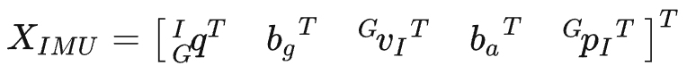

### 在EKF框架下融合IMU和视觉信息，相较于单纯的VO（所以还是一种视觉里程计算法），可以适应更剧烈的运动、一定时间的纹理缺失等，具有更高的鲁棒性；相较于基于优化的VIO算法（VINS，OKVIS），MSCKF精度相当，速度更快，适合在计算资源有限的嵌入式平台运行。在机器人、无人机、AR/VR领域，MSCKF都有较为广泛的运用，如Google Project Tango就用了MSCKF进行位姿估计  
***
1. 
  
区别在于：状态变量的选择，传统EKF-slam在特征点数过多，会出现维数爆战问题，为此改为维护一定数量的相机位姿，由于不同相机可能会看到相同的特征点，将此几何约束关系作为观测模型进行更新。
***
2. 
  
  
MSCKF中的观测模型：在惯导系统中，在滤波阶段估计再对IMU状态预测阶段利用IMU的观测加速度和角速度，更新阶段需要GPS观测构建观测模型，对状态变量的均值和方差进行更新。与此不同的是，在观测模型中，利用特征点重投影误差最小的约束；同时为了获得特征点的3D坐标，需要利用之前的位姿和三角化计算特征点坐标。 __为了提高三角化的精度，在特征点跟丢时，意味着特征点的观测不再增加，利用所有的历史相机进行三角化__
***
3. IMU初始化的问题：将前200帧加速度和角速度求平均, 平均加速度的模值g作为重力加速度, 平均角速度作为陀螺仪的bias, 计算重力向量(0,0,-g)和平均加速度之间的夹角(旋转四元数), 标定初始时刻IMU系与world系之间的夹角. 因此*MSCKF要求前200帧IMU是静止不动的*
***
  
  

4. 预积分作用：传统积分：当初值发生改变时，其后时刻的状态变量也将发生改变，在这种基于优化的VIO算法中，会增大计算量。**其主要原因在于依赖初始时刻的旋转****$R^w_{b_k}$（传统积分是在世界坐标系下的积分，当之前的旋转矩阵发生变化，当前时刻的积分要从之前更新的位置开始计算）故在等式左右两侧乘上$R^{b_k}_w$, **此时积分项中的旋转不再和初值相关，从而可以事先计算。**将原先在world系下的积分，转化到$b_k$系下。
***
5. 误差状态EKF 和 EKF的区别主要在于当进行线性化操作时，误差状态通常在零点附近，参数远离奇异点值，从而确保线性化一直有效，同时误差状态的数值较小，二阶项通常被忽略，雅各比计算速度快。
  
  
  
  
IMU的状态向量为16维，而误差的状态向量由于旋转的的误差只有三维，所以总计15维。*需要注意的是MSCKF中的运动模型只和IMU有关，观测模型和相机有关，两者通过协方差矩阵进行修正。